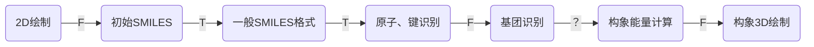
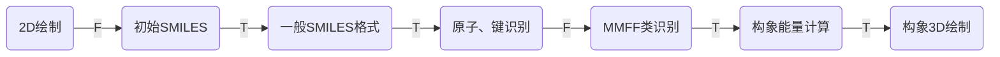

## 开发日志

#### 2025-7-15

确定选题3D分子

#### 2025-7-25

完成开题报告、确定技术路线

### 阶段目标1：学习SMILES格式转换

#### 2025-07-31

确定外文翻译：SMILES 1-2篇（or 3-4篇）

确定MMFF力场计算基本思路（Halgren两篇论文）

#### 2025-08-04

第二次确定外文翻译2018 SmileDrawer

#### 2025-08-06

完成Weininger1.阅读

#### 2025-08-10

完成Weininger 2.CANYON算法前半部分的阅读

探索Web界面：敲定蓝黑配色、白碳链，其余彩色元素。要求实现界面颜色翻转功能。

感觉JavaScript纯代码实现难度估计不大。

初步探索C++实现可能性，还是应当直接使用现成标准库。如\<vector\>等。

今日代码写作进展不大，整体有些迷茫，后续应当现做算法实现分析再写代码作。

#### 2025-08-12

完成了元素表格数据导入、化合价拆分、表格导入格式化，功能测试无误。

初步确定算法解析路径。

#### 2025-08-14

auto、模板及匿名函数学习。确定了搜索路径。

解决了元素搜索问题。LCS优化。

### 阶段目标2：CANGEN算法实现

##### （1）初始不变量的计算

###### 基础类（变量类型暂放暂放）

Atom类：原子，包含

| 名称   | 原子序数 | 原子符号 | 相对原子质量 | 化合价        |
| ------ | -------- | -------- | ------------ | ------------- |
| 变量名 | num      | sym      | mass         | val           |
| 类型   | int      | string   | ints         | vector\<int\> |

MNode类：粒子节点，包含：

| 名称   | 序号 | 元素 | 是否芳香 | 连接数 | 非氢键数 | 电荷符号 | 电荷绝对值 | 连接氢数 |
| ------ | ---- | ---- | -------- | ------ | -------- | -------- | ---------- | -------- |
| 变量名 | seq  | e    | isaroma  | ccount | nhcount  | csym     | cval       | chcount  |
| 类型   | int  | Atom | bool     | int    | int      | bool     | int        | int      |

Bond类：键

？类继承还是一个类？

| 名称   | 键数（无/单/双/三/芳/氢） | 端原子 |      |
| ------ | ------------------------- | ------ | ---- |
| 变量名 | type                      | Node   |      |
| 类型   | int                       | ANode  |      |

基础Mole类：分子，包含：

| 名称   | 节点信息表      | 键信息表                   | SMILES     |
| ------ | --------------- | -------------------------- | ---------- |
| 变量名 | nodetb          | bondtb                     | com_smiles |
| 类型   | vector\<ANode\> | ?? vector\<vector\<int\>\> | string     |

注意节点信息的同步更新。

###### 分子数据检测（SMILES格式的读取）

对于一个分子，同时生成其nodetb表和bondtb。

首先：不考虑电荷、氢键以及同位素的问题

e.g. O=n1ccccc1

从左往右遍历。每读取一个或两个字母（以第一非字母划分）则导入一个原子。依据后续是否有电荷，

```C++
string str;
//
struct RankNode{
    unsigned int invariant;
    int orirank;
    int finalrank;
}
vector<RankANode> rlist
for (auto str:ch)
{
    if //ch 为字母
    {
        记录；
    }
	else //ch 非字母
    {
        /*1、表示找到了一个原子，通过搜索给出一个这个原子，生成一个Atom；
        2、是否芳香：大小写；
        3、连接数：通过后一位的符号字母、圆括号和数字个数（注意[10]）确定。
            非氢键数：暂定=连接数
            电荷符号及绝对值：暂定0
            连接氢数：val中大于连接数的最小化合价-连接数，对于配位暂不考虑
        （？、电荷符号暂放）
        
        */
        
    }
}
```


###### 不变量数据构成

例子：CCCCC

端基C：连接数 1、非氢键数 01、原子序数 06、电荷符号 0、电荷绝对值 0、连接氢数 3.

```
data = ccount + nhcount + e.num + csym + cval + chcount 
digi =  1     +     2   +   3   +  1   +   1  +    1    = 9
```

拼成 unsigned long。

###### 秩排序及迭代

用快速排序。注意相同值节点顺序相同；

使用预先生成的素数表做素数替换（1-10000个），使用unsigned int。

迭代：使用素数乘积，当排序无变化时终止。

###### if线 破同分

迭代后仍有同排序，主动选择起始点，再次重复上述迭代。

#### 2025-08-19

确定了带有前序节点的堆栈格式，细化了分子式识别的规则。


#### 2025-08-20

完成了分子式搜索办法的编程，能够基本成功搜索结构；


#### 2025-08-21

对完善了环识别、键数识别括号识别

效果截图：

c1cc(CC=O)ccc1


[nH]1cccc1


#### 2025-08-28

##### bug1 

发现C=C-C=C输入时出现无限循环但输入C=CC=C时可退出循环，但=后排序仍然不对。


已解决：补加位移，防止死循环。修改MNode，增加固定H（int变量），修改H计算函数，修改ProcessAtom函数。


#### 2025-09-01

###### bug2

 8.28改后发现DFS识别失败，发现加了count限制，删除即可

##### 工作内容

完成了SMILES素数乘积秩排序、标准SMILES结构生成，测试基本无误。

规范了输出格式


#### 2025-09-02

优化CANGON算法输出，排除误差，进行界面设计。

GPT：


deepseek：


### 阶段目标3：结构式拼接前端

#### 2025-09-03

##### 文献示例

文献原始1：OCC(CC)CCC(CN)CN

文献结果1：CCC(CO)CCC(CN)CN


文献原始2： CC(=O)C

文献结果2：CC(C)=O

##### 其他

完成了部分前端界面。能够正常拼接原子。


### 阶段目标4：MMFF力场优化

#### 2025-10-02

MMFF94力场附录参数文件查找及表格处理

数据源：[Directory Navigator](https://ftp.wiley.com/public/journals-back/jcc/suppmat/17/490)

gacutil -i "\Microsoft.VisualStudio.Shell.Interop.12.0.dll"

找到了寻找已久的文献附录，发现只要把ftp://改为https://即可


然后使用python对其中附录.ascii文献做了初步拆分处理


#### 2025-10-03

###### 今日任务

1、把这些文件处理成.csv格式，搞明白这些文件的使用方法

2、翻译完MMFF94系列文献第一篇

3、昨天网页发现删除按钮有bug，在1完成之后需要设法修改

保证3个任务当中至少完成2个。

###### 实践情况

1、自己编写python代码，完成了表格CSV格式的转换，统一了各个变量命名方法

```py
ori_title_list = [
    ("1. MMFFSYMB.PAR", "SYMBOL,TYPE,DEFINITION+"),
    ("2. MMFFDEF.PAR", "SYMBOL,TYPE_1,TYPE_2,TYPE_3,TYPE_4,TYPE_5,DEFINITION"),
    ("3. MMFFAROM.PAR", "OLD_TYPE,AROM_TYPE,AT_NUM,RING_SIZE,L5,IM_CAT,N5_ANION"),
    ("4. MMFFHDEF.PAR", "PARANT_TYPE,HYDROGEN_TYPE"),
    ("5. MMFFPROP.PAR", "ATOM_TYPE,ASPEC,CRD,VAL,PILP,MLTB,AROM,LIN,SBMB"),
    ("6. MMFFBOND.PAR", "BT,ATOM_TYPE_I,ATOM_TYPE_J,kb,r0,Source"),
    ("7. MMFFBNDK.PAR", "ATOM_i,ATOM_j,r0(ref),kb(ref),Source"),
    ("8. MMFFANG.PAR", "ANGLE_TYPE,ATOM_TYPE_I,ATOM_TYPE_J,ATOM_TYPE_K,theta_0,Comment_origin+"),
    ("9. MMFFSTBN.PAR", "SBT,ATOM_TYPE_I,ATOM_TYPE_J,ATOM_TYPE_K,kba_IJK,kba_KJI,Source"),
    ("10. MMFFDFSB.PAR", "IR,JR,KR,F_IJK,F_KJI"),
    ("11. MMFFOOP.PAR", "ATOM_TYPE_I,ATOM_TYPE_J,ATOM_TYPE_K,ATOM_TYPE_L,koop,Source+"),
    ("12. MMFFTOR.PAR", "TT,ATOM_TYPE_I,ATOM_TYPE_J,ATOM_TYPE_K,ATOM_TYPE_L,V1,V2,V3,Source+"),
    ("13. MMFFVDW.PAR", "type,alpha_i,N_i,A_i,G_i,DA,SYMBOL,Origin"),
    ("14. MMFFCHG.PAR", "CLASS,TYPE_1,TYPE_2,bci,Source"),
    ("15. MMFFPBCI.PAR", "_,TYPE,pbci,fcadj,Origin/Comment")
]
```


2、完成了MMFF94系列文献第一篇(文献I)的翻译及公式勘误


###### 总结：

昨日目标完成2/3，基本实现预期

#### 2025-10-04

###### 今日计划

1、学习翻译完成的文献I，给出附录中各公式的参数表格。

2、通过Matlab完成文献I的公式复现及简单验证，要求给出三维结构图。

3、寻找基团结构识别算法的相关文献

4、确定系列文献中仍然需要翻译的文献，翻译至少两篇文献

条件：完成1、2，或者完成1、3和4

#### 2025-10-05

1、完成了CSV参数表格的进一步规范化

2、完成了3篇文献翻译


总结：任务完成1.5/4，由于任务难度较大，未能全部完成

#### 2025-10-06

当前情况：



T表示完成，F表示未完成但有头绪。？表示未完成且没有头绪，目前正在研究？处。

今日计划：`- [ ] `

- [x] 1、至少完成文献V的翻译。

- [x] 2、增加公式之间的关联解释，对公式解释进行整合。

- [x] 3、确定15个参数表格的使用方法及其对应公式。

- [ ] 4、寻找基团结构识别算法的相关文献

条件：至少完成1和2以及部分3

完成情况：

1、完成了文献V的翻译，至此MMFF94系列完成重要的前五篇基本完成。


2、完成了MMFF94公式梳理以及整合，确定了参数来源、参数单位以及导出方法。


今日总结：

任务完成3/4，终于明白各个参数的用途以及优化目标，解决了？处处理方法，非常大的进步。

#### 2025-10-07


今日目标：

- [x] 1、给出参数$R_{ij}$和$\varepsilon_{ij}$及$r_{ij}$的推导公式，确定三维坐标的建模方法。

- [x] 2、确定相关数据结构及优化方法。

- [ ] 3、使用C++或matlab做简单结构的计算复现，忽略EQ，给出三维坐标。

- [ ] 4、查找基团识别相关文献

条件：至少完成1、2、3


**拟牛顿法 (Quasi-Newton Methods)**

拟牛顿法不直接计算海森矩阵，而是通过迭代构造一个近似的海森矩阵。常见的算法有BFGS（Broyden–Fletcher–Goldfarb–Shanno），它在计算复杂度和收敛性上有良好的折衷。

- **优点**：比牛顿法计算量少，收敛速度较快。
- **缺点**：可能需要更多的内存来存储近似的海森矩阵。

**MATLAB实现**：

MATLAB自带的 `fminunc` 函数可以使用拟牛顿法来解决无约束优化问题，通常选用BFGS方法。

```
options = optimset('GradObj', 'on', 'MaxIter', 1000);
[x, fval] = fminunc(@(x) f(x), initial_guess, options);
```

任务完成情况：

1、完善了公式参数解释

2、给出了推导细节及优化方法


总结：任务完成2/3，有点慢，因为昨晚在研究学分相关事宜并试图上传Github然后开始跑偏到个人资料修改。

#### 2025-10-08

今日计划：

- [ ] 使用matlab做简单结构的计算复现，忽略EQ，给出分子$C_3H_8$三维坐标。（接昨天的任务）

- [ ] 查找基团识别相关文献

条件：今日两个任务必须完成。因为明天下午要去找老师，可能当场汇报！！！

任务完成情况：

1、第一次Git


2、撰写了计算示例。敲定了遍历顺序、遍历算法以及初始三维坐标生成方法。


总结：确定了整个部分的所有算法路径，matlab编写中。

#### 2025-10-10

完成了初始三维坐标的构建，完成了能量函数的撰写。


#### 2024-10-11

完成了能量遍历的方法的编程，能够正确计算出总能量。

#### 2025-10-12

尝试了一些优化方法，包括粒子群优化和拟牛顿法。但优化效果都不太理想，认为原因在于使用xyz坐标，导致可调范围太大。

现决定使用初始三维坐标计算方法，加以随机的键长可变量（$\Delta r_{change,\ ij}$）和扭转角度可变量（$\Delta \vartheta_{change,\ ij}$）。


#### 2025-10-13

优化前：每0.5秒计算一次，完成一个丙烷的计算需要45s

优化后：每0.4s计算一次，完成一个丙烷的计算需要36s

优化内容：改进表格与数组转换方式，将r及vartheta的计算提前

#### 2025-10-14

目标：改进表格索引方式。给出fast及cmpl表，给出查找方法。

优化1：为简单分子生成优化的pro或fast表

优化2：进一步将fast表的大小减小到ac*ac……

优化3：getE函数参数预计算

优化4：参数预计算的表简化。

#### 2025-10-15

优化1：计算加速，当前计算速度为0.013s一次，计算丙烷构象耗时约1s。

优化2：提出了多原子优化框架：

1、粗略计算：

​	首先按编号对于每个原子在[0，360]内做计算。设该分子键数为m=4，则每隔b=360/(m-1)/2取一次值，找最小值。

​	这样对于n个分子只需计算6n次。

​	终止条件：某一轮所有的abs(old_alpha-new_alpha)<b

2、精细计算

​	在alpha+[-b,b]范围内做计算。二分法（黄金分割法）找最小值。

​	终止条件：某一轮所有的abs(new_E-old_E)<1e-4或者abs(new_D-old_D)<1e-2


预估计算次数$=6n \times3+10 \times n≈30n$，单次计算速度复杂度为$O(n^2)$，综合下来，一个n原子分子的计算时间大致为：

$T(n)=30\times n\times 0.013/9 n^2=$

#### 2025-10-16

完成了计算的进一步优化。实现了多原子优化框架，当前单个丙烷计算速度为0.4s。实现了近100倍速度优化。预计算法层面的优化进步较小，后续根据需要可以**进一步优化matlab的数组更新及传值模式**。

#### 2025-10-17

完成了三维分子界面的设计及搭建。


#### 2025-10-18

新的优化方法！：

对于正常键旋转，r及vartheta不变，无需计算EB、EA、EBA、EOOP。

对于键角上下调整，r不变，不必计算EB

对于键长调整，vartheta不变，无需计算ET、EOOP、EA。

增加数组记录局部调整情况：

首先要求i<j

| E\调整项目               | 键水平旋转i    | 键垂直偏移i心j  | 键长伸缩ij  |
| ------------------------ | -------------- | --------------- | ----------- |
| $EB_{ij}(r_{ij})$        | 无需           | 无需            | 只算ij      |
| $EA_{ijk}(\vartheta)$    | 无需           | 仅以i为中心重算 | 无需        |
| $EBA_{ijk}(r,\vartheta)$ | 无需           | 仅以i为中心重算 | 只算ij      |
| $EOOP_{ijk;l}$           | 无需           | 仅以i为中心重算 | 无需        |
| $ET_{ijkl}$              | 仅算i及以后    | 仅算i及以后     | 仅算i及以后 |
| $EvdW$                   | n与仅算i及以后 | 仅算i及以后     | 仅算i及以后 |
|                          |                |                 |             |

#### 2025-10-19



当前问题：

1. 针对环的MMFF94计算优化（预计一天）

2. MMFFType识别算法（预计一天，C++）

3. 环芳香性识别算法（预计一天，C++）：用于实现对双键的转换。

4. 补全2D网页绘制：苯环，五元环，特殊原子 （预计一天）

5. 两个页面拼接（预计一天）

6. 数据链接及格式转换（js->c++,c++->matlab,matlab->js）（预计两天），可能涉及到将所有matlab函数转为C++函数

   特别注意：预计本周内软件设计+数据库课程学习任务需要占用2天！！！

10-25前至少完成其中4项以及前3项。

##### 测试用例

Nc1ccccc1

O=CC=CC#C

萘：C12=CC=CC=C2C=CC=C1

萘中间有1碳桥：C2C1=CC=CC=C2C=CC=C1

#### 2025-10-20

芳香性——依据huckel规则判断：

（1）离域的p轨道电子云中有4n+2个电子

（2）碳环骨架在同一平面内

（3）环上的每一个原子都有p轨道，或者孤对电子都参与电子云的离域

> [!Warning]
>
> 上述规则对于3个环以上的稠环芳烃不适用。

首先通过环识别策略，找出所有满足环内所有节点都是可离域电子的环。

#### MMFF识别算法

##### 表1 解析

第一个原子为中心原子，R表示剩下全是碳氢；

如果第一个字母和第二个字母一起可以组成一个元素，而第二个字母不能单独组成一个元素，则为双字母原子


通过短邻接表，先左后右。

如下步骤，原子在任何一步识别成功，都直接跳过剩余步骤。

1 芳香C/N/O

2 是否有三键、双键，相连的原子是否是碳

​	2.1 

取所有相邻节点，直接生成新的canSMILES结构，如果邻接表内全为C则改为R，然后不加

